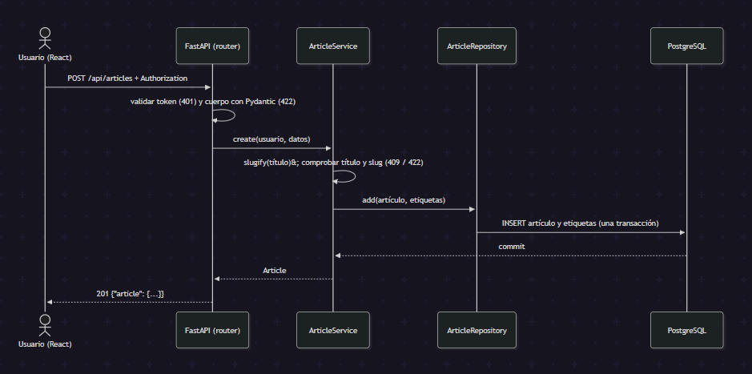

# Especificación funcional recuperada y decisiones de reimplementación

**Fuente analizada:** `Sean-Miningah/realWorld-DjangoRestFramework`, commit `8e4729aaee0a3deef8fcf5ca53a02b1565440c97`, licencia MIT (aviso de copyright: "2021 RealWorld").
**Alcance:** `POST /api/articles`, más lo mínimo que exige su autenticación (registro e inicio de sesión) y una lectura por slug para verificar el resultado.
**Regla de independencia:** el código nuevo se escribió a partir de este documento, no del código Django. Lo recuperado se clasifica en *conservar* (contrato y reglas de negocio), *corregir* (anomalías de implementación, decisión explícita) y *descartar* (detalles internos de Django).

## 1. Requisitos funcionales

| ID | Requisito |
|---|---|
| RF-01 | Registrar un usuario con nombre de usuario, correo y contraseña. |
| RF-02 | Iniciar sesión con correo y contraseña y obtener un token JWT. |
| RF-03 | Crear un artículo autenticado con título, descripción, contenido y etiquetas opcionales. |
| RF-04 | Consultar un artículo por su slug (sin autenticación). |

## 2. Reglas de negocio

| ID | Regla | Origen | Estado |
|---|---|---|---|
| BR-01 | Crear un artículo requiere autenticación (`Authorization: Token <jwt>`). | Recuperada (H-01) | Conservada |
| BR-02 | El usuario autenticado es el autor. | Recuperada (H-02) | Conservada |
| BR-03 | Todo artículo tiene un slug. | Recuperada (H-03) | Conservada |
| BR-04 | El slug lo genera el servidor a partir del título; el cliente no lo controla. | Recuperada (H-03) | Conservada |
| BR-05 | Un artículo puede tener etiquetas; `tagList` es opcional. | Recuperada (H-06) | Corregida: el original falla sin `tagList` |
| BR-06 | El título es único. | Recuperada (H-04) | Conservada; conflicto → 409 |
| BR-07 | El slug es único; título sin letras ni números → 422. | Recuperada (H-05) | Corregida |
| BR-08 | Errores de validación devuelven 422 con el campo afectado. | Nueva (H-07) | Corrección |
| BR-09 | Artículo y etiquetas se guardan en una sola transacción. | Nueva (H-16) | Corrección |
| BR-10 | Etiquetas: se recortan espacios, se eliminan vacías y duplicadas; se devuelven en orden alfabético. | Nueva (H-12) | Corrección |

## 3. Contrato de `POST /api/articles`

**Petición**
```
Authorization: Token <jwt>        (también se acepta Bearer, D-06)
{"article": {"title": str 1..150, "description": str ≥1, "body": str ≥1, "tagList": [str ≤50]  // opcional}}
```
Los campos desconocidos (p. ej. `slug`) se ignoran. Los textos se recortan antes de validar.

**Respuesta 201**
```json
{"article": {"slug": "como-entrenar", "title": "…", "description": "…", "body": "…", "tagList": ["a","b"],
  "createdAt": "2026-09-29T15:44:49.637Z", "updatedAt": "2026-09-29T15:44:49.637Z",
  "favorited": false, "favoritesCount": 0,
  "author": {"username": "omar", "bio": "", "image": null, "following": false}}}
```

| Estado | Cuándo | Cuerpo |
|---|---|---|
| 401 | Sin token, esquema inválido o token inválido/expirado (tiene prioridad sobre 422) | `{"errors":{"authorization":[…]}}` |
| 409 | Título repetido o slug ya usado | `{"errors":{"title":[…]}}` |
| 422 | Campo ausente/vacío, título > 150, etiqueta > 50, título sin letras ni números, sin wrapper `article` | `{"errors":{"<campo>":[…]}}` |

Apoyo: `POST /api/users` → 201 y `POST /api/users/login` → 200 (ambos devuelven `{"user":{username,email,bio,image,token}}`); `GET /api/articles/{slug}` → 200 / 404.

## 4. Flujo de la reimplementación


Diferencia respecto al diagrama de reconocimiento: aquí la autenticación y la validación son pasos explícitos previos al servicio, y las etiquetas se persisten en la misma transacción.

## 5. Trazabilidad de hallazgos

Las referencias de línea provienen de las capturas de la documentación de reconocimiento; completa los permalinks al commit fijado.

| ID | Hallazgo en el original | Evidencia estática | Evidencia dinámica (sección 7) | Decisión |
|---|---|---|---|---|
| H-01 | Crear exige autenticación; solo esquema `Token` | `articles/views.py`: `get_permissions`, `permission_classes` | Sin token → 401; `Bearer` → 401 | Conservar; además aceptar `Bearer` (D-06) |
| H-02 | Autor = usuario autenticado | `articles/serializers.py` `create`, l.59-67 | Respuesta con `author.username` | Conservar |
| H-03 | Slug derivado del título en el modelo; el cliente no lo controla | `articles/models.py` `save`, l.52-54 | Slug enviado por el cliente se ignora | Conservar |
| H-04 | Título único, pero el error sale como 404 | `articles/models.py`; `views.py` `create`, l.28-42 | Título duplicado → 404 | Corregir a 409 |
| H-05 | Slug único sin validación previa: colisión → 404; título "!!!" → 201 con slug vacío (en una BD limpia) | `models.py` (`unique`), `save` | Colisión → 404 | Corregir: 409 y 422 |
| H-06 | `tagList` opcional en el serializador, pero `create` la exige (`pop` sin valor por defecto) | `serializers.py` l.59-67 | Sin `tagList` → 404 | Corregir: opcional |
| H-07 | `try/except Exception` → 404 "Bad Request" para cualquier fallo | `views.py` l.28-42 | Falta de campos, título de 151, sin wrapper → 404 | Descartar; 422 por campo |
| H-08 | `updated` usa `auto_now_add`: nunca cambia | `articles/models.py` | `updatedAt` no cambia tras un PUT (prueba previa) | Corregir (`onupdate`); en creación `createdAt = updatedAt` |
| H-09 | La API renombra campos (`summary→description`, `content→body`, `created→createdAt`…) | `articles/serializers.py` | Forma de la respuesta | Conservar en el contrato; nombres internos propios |
| H-10 | Timestamps ISO-8601 UTC con `Z` (microsegundos) | `serializers.py` (`format=`) | Respuesta | Conservar formato; precisión en milisegundos |
| H-11 | `favorited`, `favoritesCount`, `author.following` calculados por petición | `serializers.py` | Respuesta | Conservar en el contrato; valores constantes (fuera de alcance) |
| H-12 | Etiquetas: se deduplican pero no se recortan (`" b "`) | `taggit` + `create` | `["a","a"," b "]` → `["a"," b "]` | Corregir (BR-10) |
| H-13 | Registro devuelve 201 sin token; login devuelve 202 | `accounts/views.py` | Registro y login | Divergir (D-07) |
| H-14 | `SECRET_KEY` fija, `DEBUG=True`, contraseña de BD `0000` en el repositorio | `config/settings.py`, `docker-compose.yml` | — | Descartar (D-04) |
| H-15 | Sin CORS configurado | `config/settings.py` | — | Añadir CORS configurable (D-08) |
| H-16 | Artículo y etiquetas se guardan en pasos separados; `ATOMIC_REQUESTS` no está configurado | `serializers.py` `create` (`save()` y `tags.add()`) | — | Corregir (BR-09) |

## 6. Decisiones técnicas

| ID | Decisión | Motivo |
|---|---|---|
| D-01 | Capas `router → service → repository → SQLAlchemy`. | Separa contrato, reglas y persistencia; estructura propia, distinta de vista/serializador de Django. Es más de lo que necesita un endpoint, pero es la arquitectura objetivo de la práctica. |
| D-02 | SQLAlchemy 2.0 síncrono y `create_all` al iniciar. | Alcance de un endpoint; migraciones (Alembic) quedan fuera. |
| D-03 | Pydantic v2 con alias para el contrato `camelCase`. | El contrato observable se conserva; el modelo interno usa nombres propios. |
| D-04 | Contraseñas con `scrypt` (biblioteca estándar); JWT HS256 (PyJWT); `SECRET_KEY` por entorno o efímera si falta. | Evita los secretos fijos del original. |
| D-05 | SQLite en memoria solo para pruebas; PostgreSQL en ejecución. | Pruebas rápidas y sin infraestructura. |
| D-06 | Se aceptan `Token` y `Bearer`. | `Token` mantiene el contrato; `Bearer` es el esquema estándar. |
| D-07 | Registro devuelve token; login responde 200. | Evita un login extra en el cliente y usa el código estándar. |
| D-08 | Proxy de Vite en desarrollo y CORS configurable por entorno. | El original no lo resolvía. |
| D-09 | `favorited=false`, `favoritesCount=0`, `following=false` constantes. | Favoritos y seguidores no forman parte del alcance. |
| D-10 | `tagList` en orden alfabético. | El original no garantiza orden. |

## 7. Validación diferencial

Mismos casos (`tools/characterize.py`) contra el original (Django con SQLite, solo para esta ejecución) y la reimplementación.

| Caso | Original | Reimplementación |
|---|---|---|
| Sin autenticación | 401 · `detail` | 401 · `errors: authorization` |
| Esquema Bearer | 401 · `detail` | 201 |
| Caso feliz con tagList | 201 | 201 |
| Título duplicado | 404 · `errors: body` | 409 · `errors: title` |
| Colisión de slug (título distinto) | 404 · `errors: body` | 409 · `errors: title` |
| Sin tagList | 404 · `errors: body` | 201 · `tagList=[]` |
| tagList vacío | 201 | 201 |
| Etiquetas repetidas y con espacios | 201 · `['a', ' b ']` | 201 · `['a', 'b']` |
| Slug enviado por el cliente | 201 · slug derivado del título | 201 · slug derivado del título |
| Título con acentos | 201 · `programacion-ae-nandu-…` | 201 · `programacion-ae-nandu-…` |
| Título solo símbolos | 404 · `errors: body` (*) | 422 · `errors: title` |
| Sin title | 404 · `errors: body` | 422 · `errors: title` |
| Sin description | 404 · `errors: body` | 422 · `errors: description` |
| Título de 151 caracteres | 404 · `errors: body` | 422 · `errors: title` |
| Sin wrapper `article` | 404 · `errors: body` | 422 · `errors: article` |

(*) En una BD limpia el original devuelve 201 con slug vacío; aquí devolvió 404 porque una prueba anterior ya había creado ese slug vacío.

**Lectura:** las reglas conservadas (BR-01 a BR-04) coinciden en ambas implementaciones; todas las diferencias corresponden a anomalías clasificadas como *corregir* o a decisiones D-06/D-07. La suite `backend/tests` (25 pruebas) fija cada regla y cada divergencia.

## 8. Consideraciones éticas y de licencia

- **Licencia.** El original es MIT: permite usar, copiar y modificar. La obligación de conservar el aviso de copyright ("2021 RealWorld") solo se activaría si se reutilizaran porciones sustanciales de código. La práctica adopta una restricción más estricta: **no se reutiliza código fuente**. Leer código público no requiere licencia; la MIT no es un "consentimiento" para la ingeniería inversa.
- **Independencia.** No es un *clean room* estricto, porque quien analiza también implementa. Es una reimplementación desde especificación: este documento se congela antes de programar y el código se escribe contra él.
- **Atribución.** Se cita el repositorio, el commit y la especificación RealWorld como origen del contrato.
- **Datos y seguridad.** No se usan datos reales; las contraseñas nunca se guardan en claro ni aparecen en la traza de la interfaz; los secretos vienen del entorno.
- **Herramientas de IA.** Declara el uso de asistentes de IA en el desarrollo según la política de la materia.

## 9. Fuera de alcance

Actualizar, borrar y listar artículos, feed, favoritos, seguidores, comentarios, paginación, migraciones (Alembic), limitación de intentos de login y pruebas automáticas del frontend.
